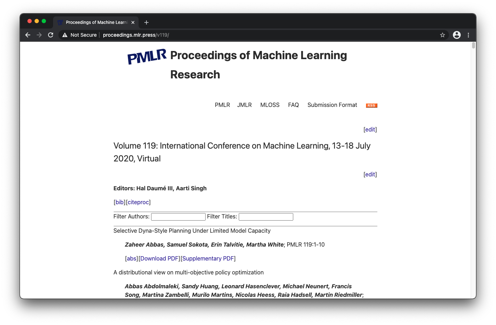
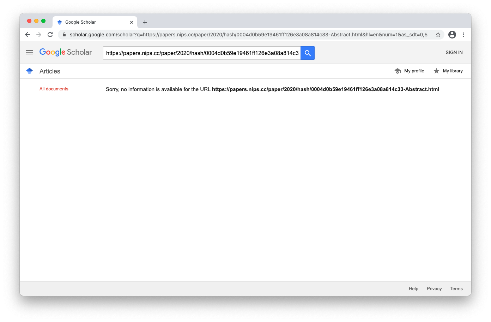
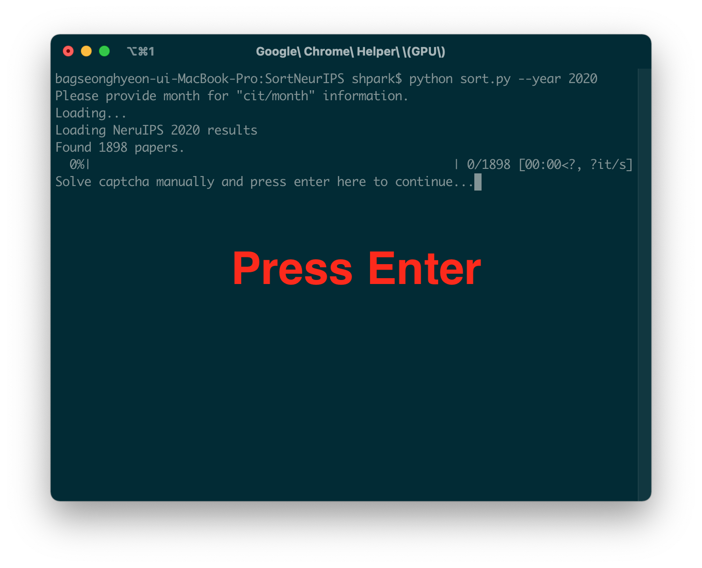
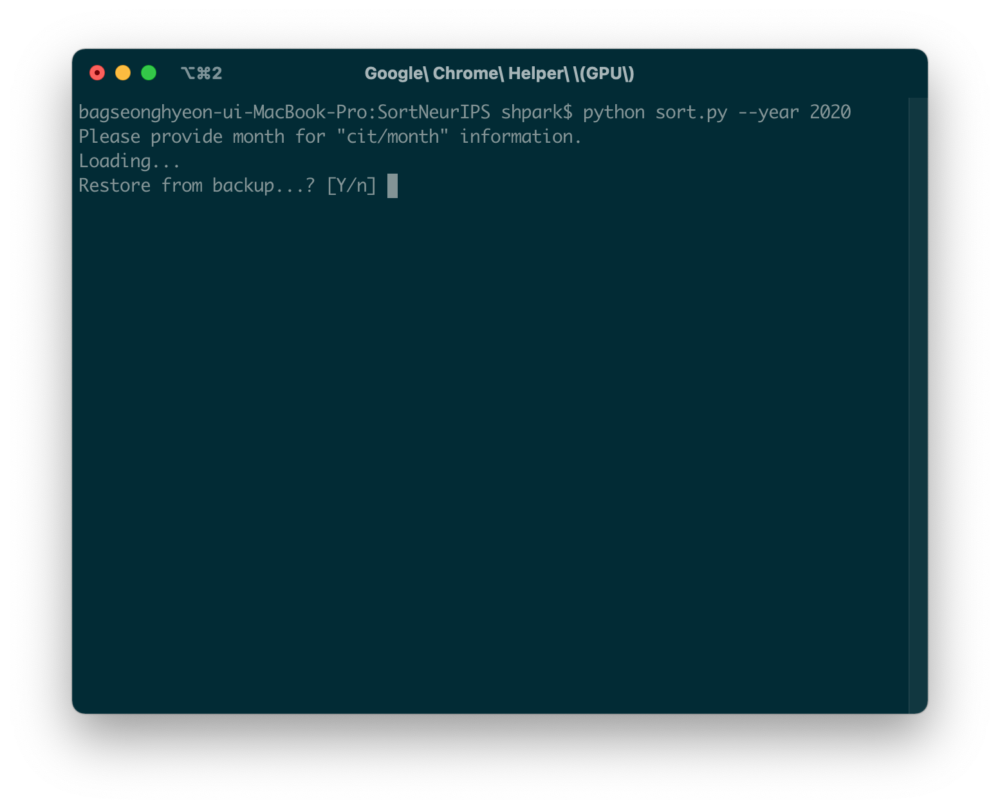

# SortICML
Sort [ICML](https://icml.cc/) papers by the number of citations.

# Description
SortICML generates a sorted list of ICML papers. It automatically searches ICML paper on Google Scholar with Selenium webdriver and captures the number of citations. Codes are developed for internal usage at [SPA Laboratory](https://www.spa.hanyang.ac.kr/); use at your own risk.

# Usage

## Environment Setup
First, you need a Python 3 environment to run this program. Once you have the environment on your system, install the following dependencies: beautifulsoup4, pandas, selenium.
```
pip install -r requirements.txt
```

## Run
The program accepts the following arguments.

```
"--year" (required): An ICML year to sort.

"--month" (optional): An ICML month. Used for calculating average citations per month.

"--csv (optional)": The location to save output *.csv file.
```

A basic usage is same as that of [SortNeurIPS](https://github.com/kami93/SortNeurIPS). This manual will sort ICML 2020 papers and output ICML2020.csv. Note that some figures are copied from SortNeurIPS; ignore minor differences.

```
python sort.py --year 2020
```

A Chrome (controlled by Selenium driver) window will open, and read the list of ICML 2020 papers from the official proceedings page.
<p align="center"></p>

Then, the program will automatically search each paper in the list and record its number of citations (See descriptions below if Google Scholar asks if you are not a robot).

<p align="center"></p>

Google Scholar sometimes asks you to solve captcha problems to prove that you are not a robot. Solve them until you pass the problems and see the search results. It is fine even if you get an empty results page.

<p align="center"></p>

<p align="center"></p>

Once you get here, press ENTER on your terminal. The program will continue working. Note that you are likely to be asked to solve captcha multiple times while the program is working. Repeat the procedures so far whenever you are asked.

<p align="center"></p>

When finished, the program will output ICML2020.csv at the current directory. The csv file will include paper ids, paper names, authors, citations (and yearly averages), sources. Papers are sorted in descending order.

<p align="center"></p>

Optinally, you can add "--month" argument to calculate the number of citations per month. It is useful when the event happend within the past few months. ICML is usally held in Summer.

```
python sort.py --year 2020 --month 7
```

You can also add "--csv" argument to set alternative location to save the output csv file.

```
python sort.py --year 2020 --month 7 --csv PATH_TO_THE_DIRECTORY
```

The program can restore from backup ("./temp/backup.pkl") saved while working. If the program is terminated for any reason just answer "Y" to the question upon the program's startup.

<p align="center"></p>